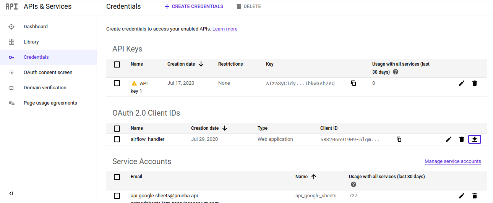

GOOGLE SPREADSHEETS OPERATOR
============================

Configuración
-------------

**Librerías necesarías**:

#. Pandas
#. SQL-Alchemy
#. Google's Api

**Instalación**:

Opción 1: teniendo el archivo requirements.txt

.. code-block:: bash

   pip install -r requirements.txt

Opción 2:

.. code-block:: bash

   pip install --upgrade google-api-python-client google-auth-httplib2 google-auth-oauthlib
   pip install SQLalchemy psycopg2-binary pandas

**Authentications**

Es neceserio crear un `proyecto de google <https://console.developers.google.com/>`_ y habilitar la api de google drive
y de google sheets. En la pestaña de credenciales, generar una nueva credencial del tipo *OAuth 2.0 Client ID* y descargar
el json.

Por último, actualizar la ruta al archivo credenciales en el archivo google_operators.py. Debajo de los imports
se encuentra declarada la variable creds_path, simplemente cambiar la que figure por la ubicación del json descargado

Se debe actualizar tambien la ruta de pickle. Pickle es un archivo que guarda la ultima autorización, por lo que acelerá
la siguiente. El archivo debe tener una extensión .pickle

Operators
---------

GoogleSheetsCopyTable
....................

Este operador toma todos los datos de la planilla y los agrega al final de a una tabla. En caso de no existir la
tabla, se generá una automáticamente (los tipo de datos pueden estar mal).

Un workflow que ejemplificaría el uso de este operador es el siguiente:

#. Generar una tabla temporal en Staging con este operador.

#. Eliminar los datos de la tabla final.

#. Copiar los datos de la tabla temporal a la final.

#. Eliminar la la tabla temporal.

De esta forma nos aseguramos de tener los datos antes de borrar la tabla final.

Parámetros (además de los básicos de un operador):

+-------------------+-----------------------------------+---------------------------------------------------------------------------------------------------------------------------------------+
| Parámetro         | Input                             | Descripción                                                                                                                           |
+===================+===================================+=======================================================================================================================================+
| connId            | String                            | Id de la conexión a la base de datos en Airflow                                                                                       |
+-------------------+-----------------------------------+---------------------------------------------------------------------------------------------------------------------------------------+
| database          | String                            | Nombre de la base de datos.                                                                                                           |
+-------------------+-----------------------------------+---------------------------------------------------------------------------------------------------------------------------------------+
| schema            | String                            | Nombre del schema.                                                                                                                    |
+-------------------+-----------------------------------+---------------------------------------------------------------------------------------------------------------------------------------+
| table_name        | String                            | Nombre de la tabla.                                                                                                                   |
+-------------------+-----------------------------------+---------------------------------------------------------------------------------------------------------------------------------------+
| spreadhseetId     | String                            | Id de la planilla (https://docs.google.com/spreadsheets/d/spreadsheetId/edit#gid=0)                                                   |
+-------------------+-----------------------------------+---------------------------------------------------------------------------------------------------------------------------------------+
| worksheet         | String                            | Nombre de la hoja que se quiere descargar.                                                                                            |
+-------------------+-----------------------------------+---------------------------------------------------------------------------------------------------------------------------------------+
| header_row        | Integer                           | Fila de los nombres de las columnas en la planilla (default 1)                                                                        |
+-------------------+-----------------------------------+---------------------------------------------------------------------------------------------------------------------------------------+
| fields_to_import  | {'Column Name': 'Database Name'}  | Columnas que se quieren descargar y nombre que le corresponde en la base de datos.                                                    |
+-------------------+-----------------------------------+---------------------------------------------------------------------------------------------------------------------------------------+
| filter_by         | String (Database_name)            | Si no hay dato en la columna especificada se elimina la fila                                                                          |
+-------------------+-----------------------------------+---------------------------------------------------------------------------------------------------------------------------------------+
| index_name        | String                            | Nombre que se le quiere dar a número de fila. Si no se especifica no se lo incluye.                                                   |
+-------------------+-----------------------------------+---------------------------------------------------------------------------------------------------------------------------------------+
| booleanize        | List [database_names]             | Columnas de tipo Yes/No; True/False que se quieran cargar como variables booleanas.                                                   |
+-------------------+-----------------------------------+---------------------------------------------------------------------------------------------------------------------------------------+
| dates             | {'Database Name': 'format'}       | Columnas con fechas. Consultar `formatos disponibles <https://docs.python.org/3.4/library/datetime.html#strftime-strptime-behavior>`_ |
+-------------------+-----------------------------------+---------------------------------------------------------------------------------------------------------------------------------------+

GoogleSheetsUpdateTable
.......................

Este operador toma los datos de la planilla y solo modifica los datos que difieran y agrega los datos nuevos. Es necesario especificar
al menos una main_key (pueden ser más) para tomar como referencia a la hora de diferenciar entre filas nuevas y modificadas.

Los parámetros son los mismos que el operador anterior, agregando el parámetro

+-----------+-----------------------+------------------------------------------------------------------------------------------------------------+
| main_keys | List [database_names] | Columnas que actuarán como primary_keys para dictaminar que filas son nuevas y cuales han sido modificadas |
+-----------+-----------------------+------------------------------------------------------------------------------------------------------------+

